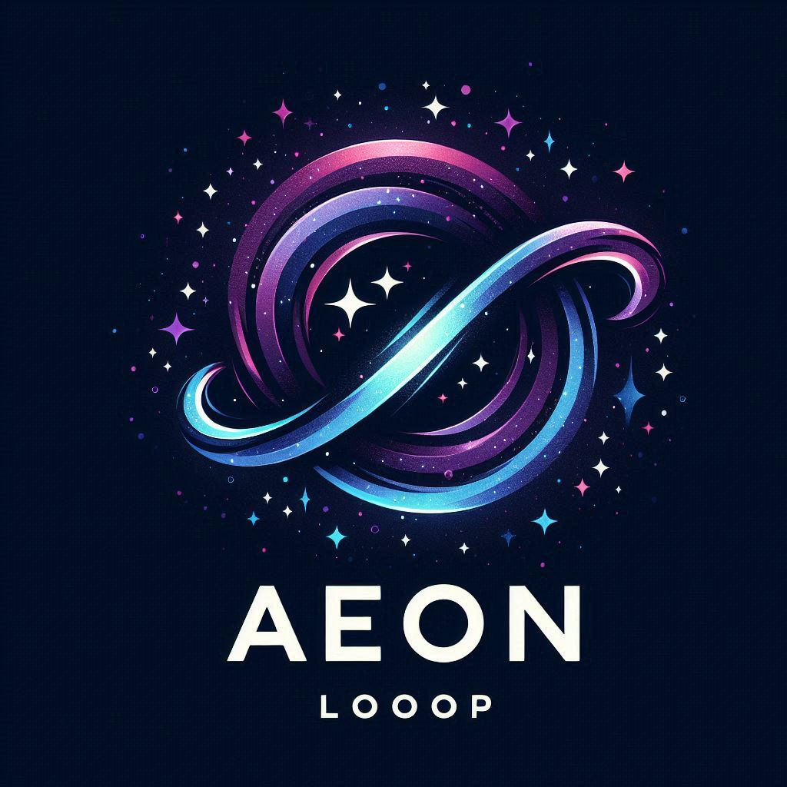

  <header class="main-header">
    
    <h1>Welcome to AeonLoop</h1>
  </header>

  <main>
    <section>
      <h2>Cosmic and Quantum Theory</h2>
      

        I'm still working on this page to ease the navigation, so bear with me.
        I'm currently uploading the written content! its best to read it on a
        bigger screen, like a laptop or pc
      

    </section>

    <!-- Button to access your Papers -->
    <section>
      <a href="papers/" class="button">View My Papers</a>
    </section>
    <!-- Button to access the Calculator -->
    <section>
      <a href="Calculator/" class="button">Open Full Digital‑Tick Calculator</a>
    </section>
    <!-- Button to access the README file -->
    <section>
      <a href="https://cosmicreplicator.github.io/AeonLoop/papers/README.html" class="button" target="_blank">
        Read the Full README
      </a>
    </section>
  </main>

  <!-- Add the comment section right before the closing body tag -->
  

  

<!-- End of no-bg-container -->
